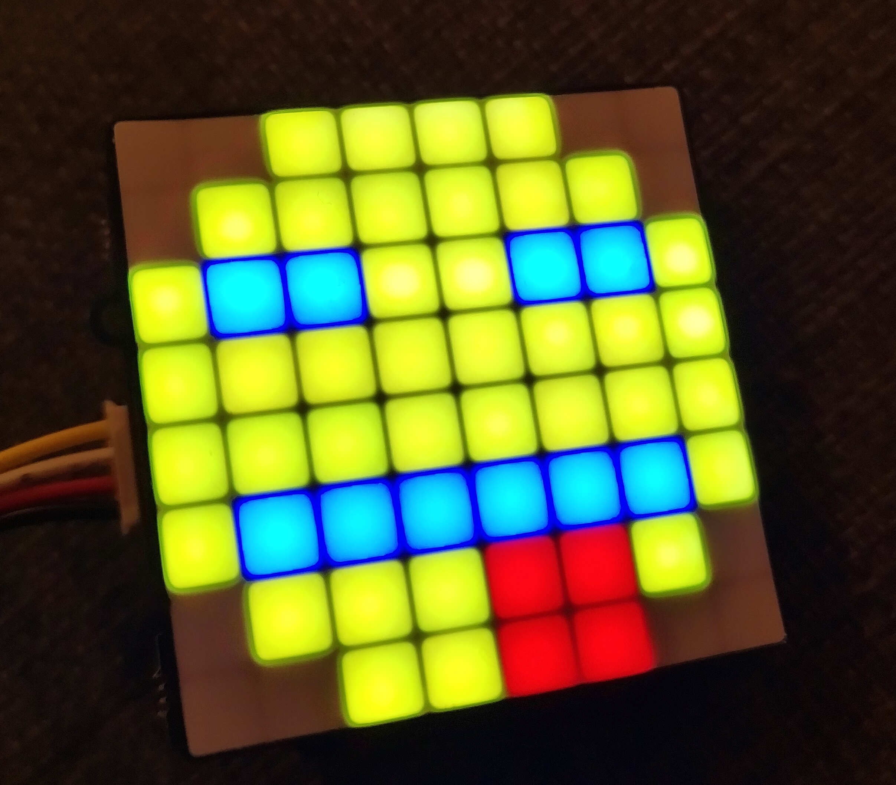
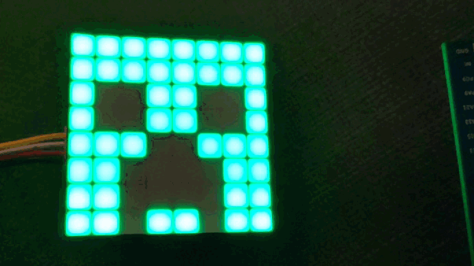

<p align="center">
    <a href="https://github.com/pyaillet/grove-matrix-led-my9221-rs/actions/workflows/ci.yml"></a>
    <a href="https://crates.io/crates/grove-matrix-led-my9221"></a>
    <a href="https://docs.rs/grove-matrix-led-my9221"></a>
</p>

# Grove RGB Matrix Led Rust Driver

Rust driver for [Grove RGB Matrix Led with my-9221 Driver](https://wiki.seeedstudio.com/Grove-RGB_LED_Matrix_w-Driver/)

## Example

You can use the example provided for the [stm32f3-discovery board](https://www.st.com/en/evaluation-tools/stm32-discovery-kits.html)

```sh
# Install Cargo embed
cargo install cargo-embed

# Flash the board
cargo embed --chip STM32F303VCTx --release --example stm32f3-discovery-example --target thumbv7em-none-eabihf

```

## Example result

A simple smiley:


Picture changing:

